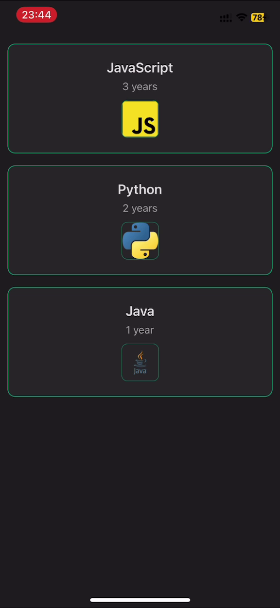

Лабораторная работа 2. Создание списков в приложении на React Native
Ход лабораторной работы:

1) Создайте проект на React Native с Expo

2) Создайте компонент, в котором будет три элемента - заглавный текст с названием языка программирования, текстом с опытом изучения и изображение логотипа языка программирования 

3) Создайте список объектов, данные из которых будут использованы в компонентах при отрисовке списка 

4) Создайте список, используя в качестве данных список из п.3, в качестве элементов списка - компонент из п.2

5) (Необязательно) - добавьте в список Pull To Refresh

